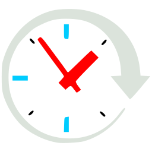
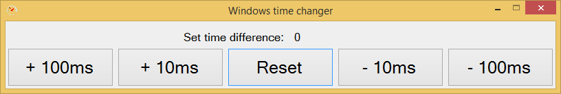

#  ClockMillisecondsChanger

Windows clock time changer forward or backwards in milliseconds. Application resets time changes and tries to resync windows clock on application close or `Reset` button press.

## Applications UI screenshot

